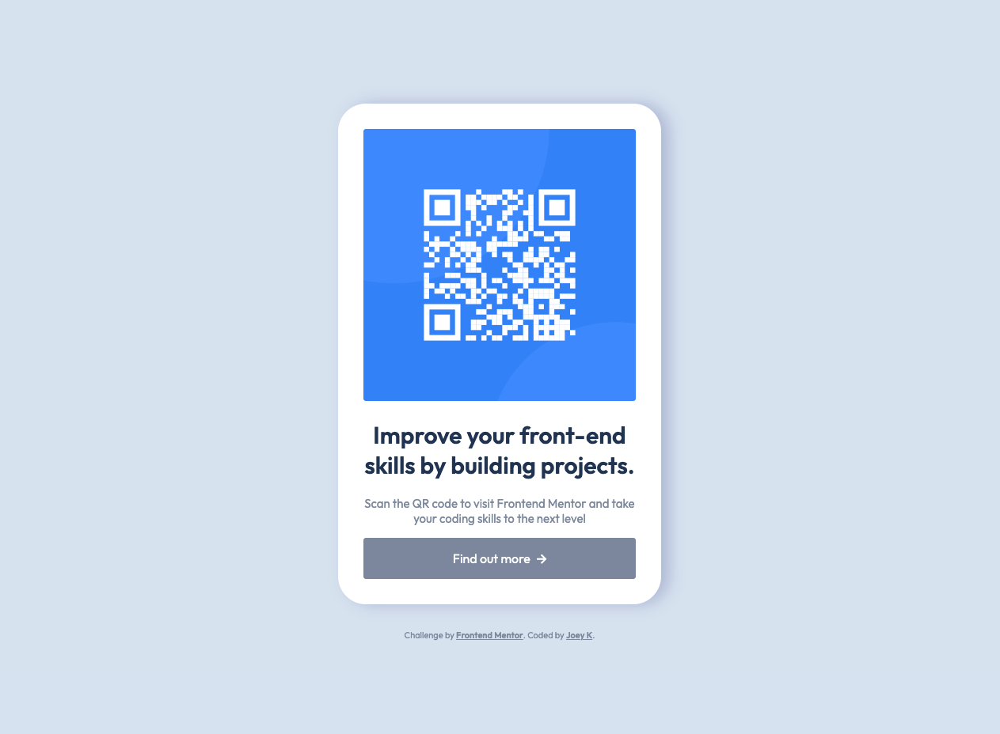

# Frontend Mentor - QR code component solution

This is a solution to the [QR code component challenge on Frontend Mentor](https://www.frontendmentor.io/challenges/qr-code-component-iux_sIO_H).

## Table of contents

- [Overview](#overview)
  - [Screenshot](#screenshot)
  - [Links](#links)
- [My process](#my-process)
  - [Built with](#built-with)
  - [What I learned](#what-i-learned)
  - [Continued development](#continued-development)
  - [Useful resources](#useful-resources)
- [Author](#author)

## Overview

### Screenshot



### Links

- Solution URL: [https://github.com/joeykelava/fm-qr-code](https://github.com/joeykelava/fm-qr-code)
- Live Site URL: [https://joeykelava.github.io/fm-qr-code/](https://joeykelava.github.io/fm-qr-code/)

## My process

### Built with

- Semantic HTML5 markup
- CSS custom properties
- Flexbox
- CSS Grid
- Mobile-first workflow
- Google Fonts
- Animations
- VS Code

### What I learned

This is the first time I have used VS Code exclusively to build a page using HTML and CSS. Besides the learning curve of understanding a new program, I think I'm quite proud of how much I've learned along the way.

I've even gone ahead and created an additional section by adding a button, and the button is sized to the width of the card itself.

Couple things I've learned along the way:

```html
<button> tags need a javascript to direct user to a new page, and also need a 'cursor:pointer' in CSS. Unlike <a> tags where you only need a 'href="(web-address)"', button tags need a little more HTML and CSS love to style.

For example:
<button class="card_button" onclick="document.location='https://josipkelava.com/'">Find out more</button>
```

```css
Including variables helped with colours, radius and padding.

One in particular is on the '.card' class:
--Card_radius: 2.2rem;
--Card_padding: 2rem;
border-radius: calc(var(--Card_radius) - var(--Card_padding))

This equation helped me create the padding of the image based on the padding of the card itself. This was to avoid that funky uneven border-radius effect when the inner radius looks bigger than the outer one.
```


### Continued development

Understanding javascript is in continued development as I would like to understand how to make things more interactive.

I'm confused about why 'max-width:' helps with resizing as opposed to 'width:'. My current understanding of this is that 'width:' is a defined 'fixed' value, meaning it won't change in size, unless the parent container allows it to. 'max-width' offers that flexibility. Would need to test more to see how this would work in future projects.

Another common CSS confusion is understanding GRID vs FLEXBOX, and when to use for appropriate scenarios.

### Useful resources

- [Button Cheatsheet](https://www.buttoncheatsheet.com/) - This helped me understand the importance of buttons vs links vs input.

## Author

- Website - [Josip Kelava](https://www.josipkelava.com)
- Frontend Mentor - [@joeykelava](https://www.frontendmentor.io/profile/joeykelava)
- Twitter - [@JosipKelava](https://twitter.com/JosipKelava)
